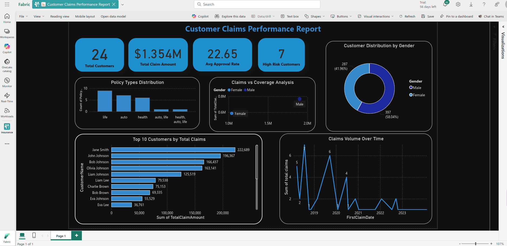
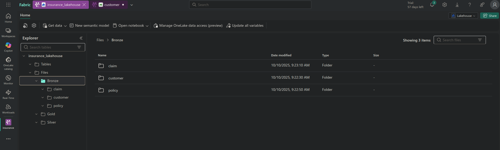
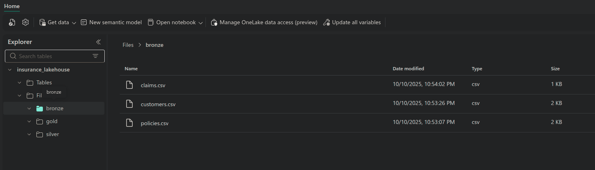
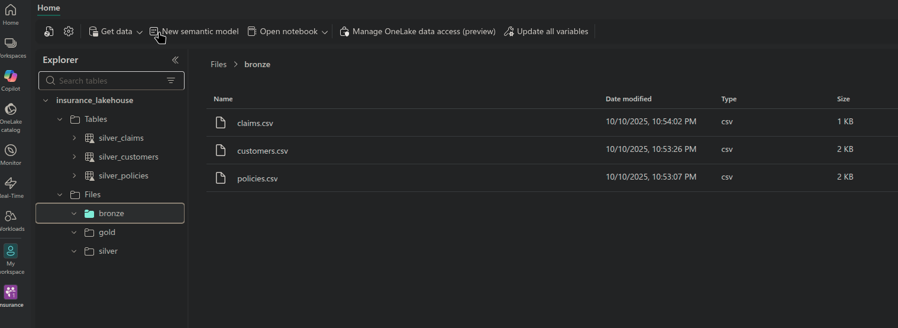
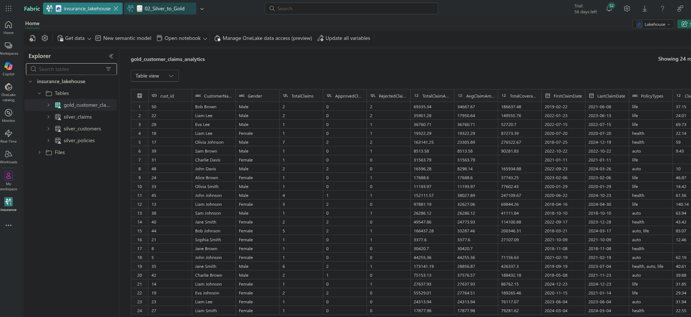

# Insurance Claims Analytics - End-to-End Data Engineering


Insurance Claims Analytics - End-to-End Data Engineering

> 💡 **Project Goal:** Build a scalable insurance claims analytics system demonstrating Medallion Architecture with Microsoft Fabric.

---

## 🚀 Technical Overview

| Feature | Implementation | Business Impact |
|---------|---------------|-----------------|
| **📦 Data Pipeline** | AWS S3 → Fabric Lakehouse → Delta Tables | Automated, scalable ingestion |
| **🔄 ETL Processing** | PySpark notebooks with data quality checks | 3-layer Medallion Architecture |
| **📊 Analytics** | 24 customers, $1.354M claims analyzed | Real business insights |
| **📈 Visualization** | Power BI dashboard (4 KPIs + 5 charts) | Executive-ready reporting |
| **⚡ Tech Stack** | Python + PySpark + Fabric + Power BI + Delta Lake | Modern data platform |

---

## 📸 Power BI Dashboard Preview

### Customer Claims Performance Report


**Key Metrics Delivered:**
- 📊 **24 Total Customers** analyzed across 50 claims
- 💰 **$1.354M Total Claim Amount** processed
- ✅ **22.65% Average Approval Rate** calculated
- ⚠️ **7 High-Risk Customers** identified (claim-to-coverage ratio > 50%)

**Business Questions Answered:**
1. Who are the top claimers? *(Top 10 visualization)*
2. What's the approval rate by gender? *(58% Female, 42% Male distribution)*
3. Which policy types drive most claims? *(Life, Auto, Health analysis)*
4. How do claims trend over time? *(2019-2023 temporal patterns)*
5. Are claims proportional to coverage? *(Scatter plot correlation)*

---

## 🏗️ Data Pipeline Architecture: AWS S3 -> Microsoft Fabric (Medallion Layers) -> Power BI

```
┌─────────────────────────────────────────────────────────────┐
│                   CLOUD STORAGE LAYER                        │
├─────────────────────────────────────────────────────────────┤
│  AWS S3 (Production)                                         │
│  ├── Bucket: insurance-data-fabric                           │
│  ├── bronze/customers.csv                                    │
│  ├── bronze/policies.csv                                     │
│  └── bronze/claims.csv                                       │
│                                                               │
│  [Local Dev: MinIO via ngrok for HTTPS tunneling]           │
└─────────────────────────────────────────────────────────────┘
                            ↓
┌─────────────────────────────────────────────────────────────┐
│           MICROSOFT FABRIC - LAKEHOUSE (Medallion)           │
├─────────────────────────────────────────────────────────────┤
│  📦 BRONZE Layer (Raw Ingestion)                             │
│  ├── S3 Connector → Fabric Lakehouse                         │
│  ├── Format: Delta Tables                                    │
│  └── Raw data (customers, policies, claims)                  │
│                                                               │
│  🔄 SILVER Layer (Cleaned & Validated)                       │
│  ├── PySpark: 01_Bronze_to_Silver.ipynb                      │
│  ├── Data quality checks, null handling                      │
│  ├── Date parsing, type casting                              │
│  └── 3 Delta Tables: silver_customers, policies, claims      │
│                                                               │
│  ✨ GOLD Layer (Business Analytics)                          │
│  ├── PySpark: 02_Silver_to_Gold.ipynb                        │
│  ├── Multi-table joins, aggregations                         │
│  ├── KPIs: approval rates, risk scoring                      │
│  └── Table: gold_customer_claims_analytics (24 customers)    │
└─────────────────────────────────────────────────────────────┘
                            ↓
┌─────────────────────────────────────────────────────────────┐
│                  VISUALIZATION LAYER                         │
├─────────────────────────────────────────────────────────────┤
│  Power BI (Fabric Integration)                               │
│  ├── 4 KPI Cards ($1.354M claims, 22.65% approval)          │
│  ├── 5 Interactive Charts (gender, policy, trends)          │
│  └── Customer Claims Performance Report                      │
└─────────────────────────────────────────────────────────────┘
```

## ⚡ Quick Start

```bash
# 1. Clone and setup environment
git clone https://github.com/Daniel-jcVv/insurance-analytics-medallion.git
cd insurance-analytics-medallion
python -m venv venv && source venv/bin/activate
pip install -r requirements.txt

# 2. Option A: AWS S3 (Recommended for Fabric integration)
cp .env.example .env  # Add your AWS credentials
python scripts/upload_to_s3.py

# 2. Option B: Local MinIO (Development/Testing)
docker compose up -d
python scripts/upload_to_minio_production.py  # Uses HTTPS endpoint

# 3. Microsoft Fabric
# - Open Fabric workspace → Create Lakehouse
# - Run notebooks: 01_Bronze_to_Silver.ipynb → 02_Silver_to_Gold.ipynb
# - Open Power BI → Connect to Gold layer → Build dashboard
```


> **Note:** MinIO is available for local development with HTTPS tunneling (ngrok), but AWS S3 is the recommended production source for direct Fabric integration. [MinIO vs AWS S3](./docs/MinIO/MinIO_issuess.md) 

---

## 📋 Prerequisites

- Docker and Docker Compose
- Python 3.8+
- Microsoft Fabric trial account
- AWS account (for S3 option)


## 📁 Project Structure

```
insurance-claims/
├── docker-compose.yml               # MinIO configuration
├── requirements.txt                 # Python dependencies
├── .env.example                    # Environment variables template
├── .gitignore                      # Files to ignore
├── README.md                       # This file
│
├── data/
│   └── raw/                        # CSV files (50 records each)
│       ├── customers.csv
│       ├── policies.csv
│       └── claims.csv
│
├── scripts/
│   ├── upload_to_minio.py          # Upload to MinIO (local dev)
│   ├── upload_to_minio_production.py  # Production MinIO (retry + logging)
│   ├── upload_to_s3.py             # Upload to AWS S3 (cloud/Fabric)
│ 
│
├── tests/
│   ├── test_upload.py              # Integration tests
│   └── README.md                   # Test documentation
│
├── fabric/
│   └── notebooks/
│       ├── 01_Bronze_to_Silver.ipynb   # Data cleaning & validation
│       └── 02_Silver_to_Gold.ipynb     # Business metrics & analytics
│
├── power-bi/
│   └── Customer-Claims-Performance-Report.png  # Dashboard screenshot
│
├── docs/
│   └── screenshots/
│       └── fabric/                 # Fabric workspace screenshots
│           ├── 03-fabric-bronze-files.png
│           ├── 05-fabric-silver-tables.png
│           └── 06-fabric-gold-tables.png
│
│
├── minio/
│   └── data/                       # MinIO persistent storage (gitignored)
│___

```

## 🎯 Implementation Stages (MVP)

### Stage 1: FOUNDATION - "It Works"
- MinIO running in Docker
- 50 records in each CSV file
- AWS S3 bucket created and data uploaded
- Fabric workspace created



**Bronze Layer - Raw Data Ingestion:**



---

### Stage 2: TRANSFORMATION - "It's Clean"
- Silver layer notebook created ([01_Bronze_to_Silver.ipynb](fabric/notebooks/01_Bronze_to_Silver.ipynb))
- Data cleaning implemented (dates, nulls, formatting)
- 3 Silver Delta tables written



---

### Stage 3: ANALYTICS - "It Answers Questions"
- Tables joined (claims → policies → customers)
- Gold aggregation table created (`gold_customer_claims_analytics`) [02_Silver_to_Gold.ipynb](fabric/notebooks/02_Silver_to_Gold.ipynb)
- Business metrics calculated (approval rates, coverage ratios, temporal analysis)
- Data quality checks implemented
- Business insights generated



---

### Stage 4: VISUALIZATION - "It's Presentable"
- Power BI report created (`Customer Claims Performance Report`)
- Dashboard with KPIs and visualizations
- Portfolio screenshots captured

*(See dashboard preview at the top of this README)*

### Stage 5 (Optional): SCALE - "It Handles More"
- 🔲 Script to generate 200-500 records
- 🔲 Pipeline re-run with larger dataset


## 📈 Scalability & Production Readiness

### Simple Version (`upload_to_minio.py`)
**Use for:** MVP, demos, small datasets
- Basic error handling
- File validation


### Production Version (`upload_to_minio_production.py`)
**Use for:** Larger datasets, production environments
- Retry logic with exponential backoff
- Parallel uploads (4 workers)
- Logging to file
- Progress bars


## 🔧 Useful Commands

```bash
# View MinIO logs
docker compose logs -f minio

# Stop MinIO
docker compose down

# Clean MinIO data (destructive)
docker compose down -v

# Upload data to MinIO (simple)
python scripts/upload_to_minio.py

# Upload data to MinIO (production)
python scripts/upload_to_minio_production.py

# Verify data in MinIO
# Access http://localhost:9101 and explore the bucket
```

## 💼 Data Engineering Skills 

| Skill Category | Technologies Used | Implementation |
|----------------|-------------------|----------------|
| **Data Pipelines** | AWS S3, Microsoft Fabric, Delta Lake | [Bronze→Silver→Gold notebooks](fabric/notebooks/) |
| **Big Data Processing** | PySpark, Delta Lake (ACID) | [Data transformations](fabric/notebooks/02_Silver_to_Gold.ipynb) |
| **Cloud Platforms** | Microsoft Fabric, AWS S3 | Production-ready lakehouse architecture |
| **Business Intelligence** | Power BI (visualizations) | [Interactive dashboard](power-bi/) |
| **Data Quality** | PySpark validations, null handling | Data quality checks in Silver layer |
| **Infrastructure** | Docker, MinIO, S3-compatible storage | [docker-compose.yml](docker-compose.yml) |
| **Programming** | Python, PySpark, SQL | [Scripts](scripts/) and notebooks |
| **Architecture** | Medallion (Bronze/Silver/Gold) | Complete 3-layer implementation |

**Key capabilities:** Implements production patterns: data quality checks, error handling, ACID transactions, and cloud integration.

## 🎯 Architecture Strategy

**Dual Storage Approach:**
- **MinIO (Local):** S3 API integration patterns, pipeline testing without cloud costs, infrastructure-as-code
- **AWS S3 (Cloud):** Direct Fabric integration, production-ready data source, automated pipelines
- **Microsoft Fabric:** Medallion Architecture implementation, PySpark transformations, Power BI dashboards


## 📞 Contact Information

**Daniel García Belman**  
*Data Engineer | ETL Developer | Big Data*

| Platform | Link |
|----------|------|
| **Email** | [daniel_ys1@outlook.com](mailto:daniel_ys1@outlook.com) |
| **LinkedIn** | [Daniel García Belman](https://www.linkedin.com/in/daniel-garcía-belman-99a298aae) |
| **GitHub** | [@Daniel-jcVv](https://github.com/Daniel-jcVv) |
| **Location** | Celaya, Guanajuato, Mexico 🇲🇽 |
|              | Querétaro, Querétaro, Mexico 🇲🇽 |
| **Portfolio**| [Portfolio Website](https://danieljcvv-portfolio.vercel.app/)


---

## 📚 Resources

- [Microsoft Fabric Docs](https://learn.microsoft.com/en-us/fabric/)
- [MinIO Documentation](https://min.io/docs/minio/linux/index.html)
- [Medallion Architecture](https://www.databricks.com/glossary/medallion-architecture)
- [PySpark Documentation](https://spark.apache.org/docs/latest/api/python/)
- [Delta Lake](https://delta.io/)

---

